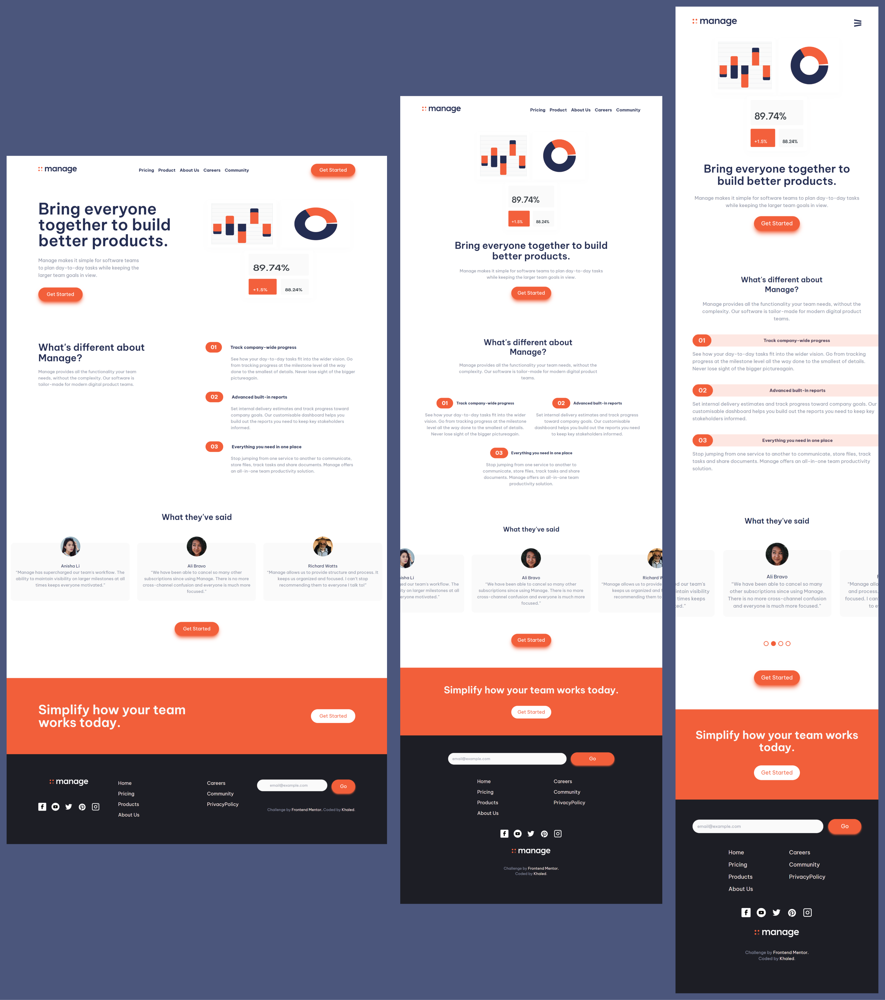

# Manage website landing page

## Overview

This is a solution to the [Manage landing page challenge on Frontend Mentor](https://www.frontendmentor.io/challenges/manage-landing-page-SLXqC6P5). Frontend Mentor challenges help you improve your coding skills by building realistic projects.

### Design preview

### Development preview

### The challenge

Users should be able to:

- View the optimal layout for the site depending on their device's screen size
- See hover states for all interactive elements on the page
- See all testimonials in a horizontal slider
- Receive an error message when the newsletter sign up `form` is submitted if:
  - The `input` field is empty
  - The email address is not formatted correctly

### Links

- [Live Demo URL](https://manage-landing-page-vanilla-ts.onrender.com/)
- [ Soultion URL ](https://www.frontendmentor.io/challenges/manage-landing-page-SLXqC6P5/hub/manage-landing-page-e4BiXxS32J)

## Built with

- Semantic HTML5 markup
- TailwindCSS and Sass
- Mobile-first workflow
- Typescript
- Vite (build tool)

## How to Use

### Available Scripts:

In the project directory, you can run:

### `npm run dev`

Runs the app with vite in the development mode.\
Open [http://127.0.0.1:5173/](http://127.0.0.1:5173/) to view it in the browser.

### `npm run build`

Builds the app for production to the `dist` folder.\
It correctly bundles the app in production mode and optimizes the build for the best performance.

The app is ready to be deployed!

### `npm run preview`

Runs a preview for the website in production mode from `dist` folder.
